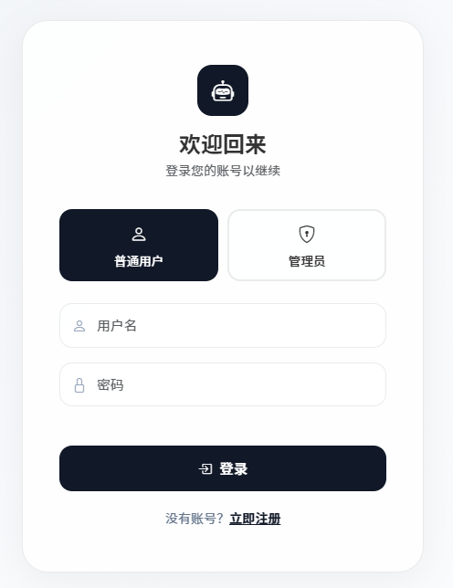
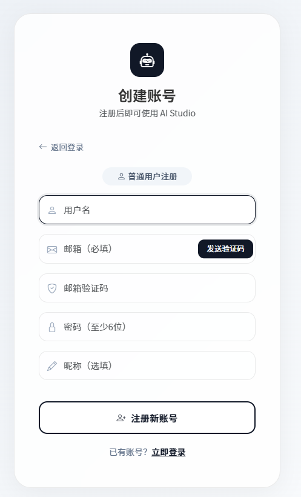
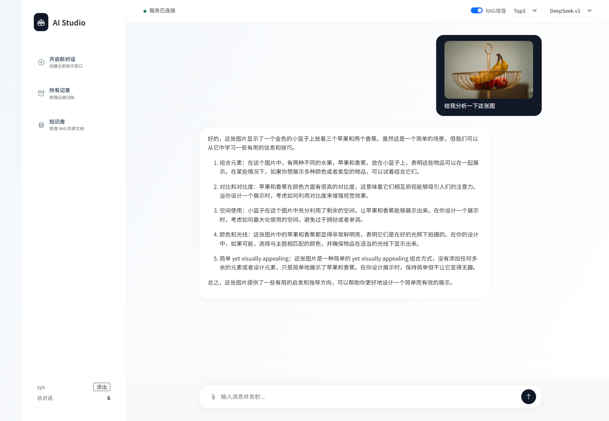
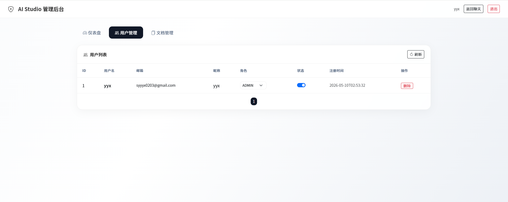
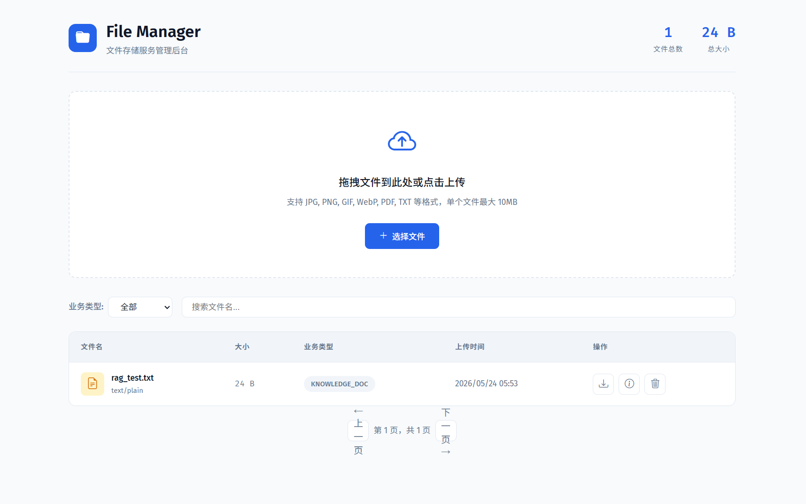

# AI Studio — 智能客服聊天机器人 作品集

> 基于 Spring Boot 3.2 + Spring Cloud 的全栈微服务智能客服系统

---

## 项目概览

| 项目 | 说明 |
|------|------|
| 项目名称 | AI Studio 智能客服 |
| 技术栈 | Spring Boot 3.2 / Spring Cloud Gateway / Spring AI / MyBatis-Plus / Kafka / Nacos |
| 基础设施 | MySQL 8.0 / Redis 7 / Kafka (KRaft) / Nacos |
| AI 模型 | DeepSeek（云端）+ Ollama qwen2.5（本地）+ llava（多模态视觉） |
| 部署方式 | Docker Compose 一键部署（7 个服务）+ 阿里云轻量服务器 |
| 源码 | [GitHub](https://github.com/yyx758/springai-chatbot) |
| 在线地址 | http://111.229.127.171:8080 |

---

## 系统架构（v19 微服务）

```
┌─────────────────────────────────────────────────────────┐
│                   Docker Compose                         │
│                                                         │
│  ┌───────────────┐  ┌──────────────┐  ┌──────────────┐ │
│  │chatbot-service│  │ file-service │  │   gateway    │ │
│  │    :8080      │  │    :8081     │  │    :9000     │ │
│  └───┬───┬───────┘  └──┬──┬────────┘  └──────────────┘ │
│      │   │              │  │                             │
│      ▼   ▼              │  │                             │
│  ┌──────┐ ┌──────┐     │  │                             │
│  │MySQL │ │Redis │◄────┘  │                             │
│  │:3306 │ │:6379 │        │                             │
│  └──────┘ └──────┘        │                             │
│      │                    │                             │
│      ▼                    │                             │
│  ┌──────────────────┐    │                             │
│  │      Kafka       │◄───┘                             │
│  │  事件驱动异步通信  │                                   │
│  └──────────────────┘                                   │
│         ▲                                               │
│  ┌──────┴──────────┐                                    │
│  │     Nacos       │  服务注册与发现                      │
│  └─────────────────┘                                    │
└─────────────────────────────────────────────────────────┘
```

**服务说明：**

| 服务 | 端口 | 职责 |
|------|------|------|
| chatbot-service | 8080 | 聊天对话、认证鉴权、知识库 RAG、管理后台 |
| file-service | 8081 | 文件上传/下载、图片压缩/缩略图、PDF/DOCX 文档解析 |
| gateway | 9000 | 统一路由 + JWT 鉴权 |
| MySQL | 3306 | 持久化存储 |
| Redis | 6379 | 缓存、Token、验证码 |
| Kafka | 9092 | 聊天持久化、通知邮件、知识库事件 |
| Nacos | 8848 | 服务注册与配置管理 |

---

## 核心功能展示

### 1. 登录注册页

邮箱验证码注册，JWT 双令牌认证，BCrypt 密码加密。





**技术亮点：**
- 邮箱验证码：SMTP 发送，Redis 存储，5 分钟有效，60 秒发送间隔
- JWT 双令牌：Access Token 30 分钟 + Refresh Token 7 天
- Token 轮转：Redis `getAndDelete` 原子操作，防重放攻击
- 前端静默刷新：`authFetch()` 遇到 401 自动刷新令牌，用户无感知

---

### 2. AI 对话界面

支持双模型切换、SSE 流式输出、RAG 检索增强、多模态图文混合输入。



**技术亮点：**
- **双模型架构**：DeepSeek 云端 + Ollama 本地（qwen2.5），运行时自由切换
- **SSE 流式输出**：Server-Sent Events，打字机效果实时推送
- **多模态图文输入**：支持图片上传、粘贴、拖拽，自动路由到 Ollama llava 视觉模型
- **RAG 检索增强**：自研关键词匹配评分算法（标题+40/正文+30/标签+20），零向量数据库
- **上下文记忆**：Redis List 缓存 + Kafka 异步持久化 MySQL
- **并发控制**：Ollama `Semaphore(1)` 排队，SSE 实时推送排队状态

---

### 3. 管理后台

仪表盘统计、用户管理（角色/启禁用/删除）、知识文档管理，自研 `@RequireRole` 注解驱动 RBAC。



**技术亮点：**
- **注解驱动 RBAC**：`@RequireRole("ADMIN")` 类级/方法级注解，不依赖 Spring Security
- **仪表盘**：用户总数、对话总数、知识文档数实时统计
- **用户管理**：角色切换、启用/禁用、删除（管理员自保护）
- **Gateway 鉴权**：请求经 Gateway 统一校验 JWT，非法请求在网关层拦截

---

### 4. 文件管理中心

统一管理所有上传文件（聊天图片 + 知识库文档），支持分页、预览、下载、删除。



**技术亮点：**
- **存储抽象**：FileStorage 接口，支持本地磁盘 / MinIO 对象存储切换
- **图片处理**：上传自动压缩（>2MB JPEG→80%质量）+ 200x200 缩略图生成
- **文档解析**：PDF（Apache PDFBox）/ DOCX（Apache POI）/ TXT/MD 自动解析为文本
- **文件类型**：CHAT_IMAGE / KNOWLEDGE_DOC / AVATAR 分类管理
- **元数据持久化**：MySQL 存储文件元数据，分页查询，按时间排序

---

### 5. 知识库（RAG）

支持手动输入文本或上传 PDF/DOCX/TXT 文档自动解析，检索测试实时查看召回效果。

**技术亮点：**
- **文档上传即解析**：上传 PDF/DOCX → file-service 解析 → 自动填充内容 → 保存到知识库
- **关键词评分检索**：对标题/正文/标签三级评分 + 中文 2-gram 子词切分
- **可配置 Top-K**：1/3/5 个召回结果可选
- **检索测试**：实时查看每个知识文档的匹配分数和召回片段
- **Kafka 事件同步**：知识库变更后自动刷新 RAG 缓存

---

## Docker 容器化部署

```bash
# 一条命令启动所有 7 个服务
docker compose up -d

# 查看所有服务状态
docker ps --format "table {{.Names}}\t{{.Status}}"

# 结果：
# chatbot-gateway   Up 4 minutes
# chatbot-service   Up 4 minutes
# file-service      Up 4 minutes
# chatbot-kafka     Up 5 minutes (healthy)
# chatbot-nacos     Up 5 minutes (healthy)
# chatbot-redis     Up 5 minutes (healthy)
# chatbot-mysql     Up 5 minutes (healthy)
```

**部署特点：**
- 多阶段构建将编译和运行分离，最终镜像仅 400MB
- 环境变量注入实现配置与代码分离（`.env` 文件）
- Docker 内部 DNS 自动解析服务名（`mysql` → 容器 IP）
- Volume 数据卷持久化，容器重建数据不丢失
- 健康检查 + `depends_on` 确保启动顺序

---

## 技术栈详情

| 类别 | 技术 | 说明 |
|------|------|------|
| 后端框架 | Spring Boot 3.2 + Java 17 | 主框架 |
| 微服务 | Spring Cloud Gateway + Nacos | 网关路由 + 服务注册发现 |
| 消息队列 | Kafka (KRaft 模式) | 事件驱动异步通信 |
| AI 集成 | Spring AI 1.0.0 GA | 多模型对话、流式输出（SSE） |
| ORM | MyBatis-Plus 3.5 | 分页、Lambda 查询 |
| 数据库 | MySQL 8.0 + Flyway | 持久化 + 版本迁移 |
| 缓存 | Redis 7 | 会话缓存、Token 存储、验证码 |
| 认证安全 | JWT + BCrypt + RBAC | 双 Token 刷新、角色权限控制 |
| 邮件 | Spring Mail (SMTP) | 邮箱验证码注册 |
| 模板引擎 | Thymeleaf + Bootstrap 5 | 服务端渲染页面 |
| 容器化 | Docker + Docker Compose | 多阶段构建，7 服务编排 |
| 文档解析 | Apache PDFBox + POI | PDF/DOCX/TXT 自动解析 |
| CI/CD | GitHub Actions | 自动构建 |

---

## 数据库设计

### user_account
| 列 | 类型 | 说明 |
|-----|------|------|
| id | BIGINT PK | 主键 |
| username | VARCHAR(64) UNIQUE | 用户名 |
| email | VARCHAR(128) UNIQUE | 邮箱 |
| password_hash | VARCHAR(255) | BCrypt 密码哈希 |
| display_name | VARCHAR(64) | 显示名称 |
| role | VARCHAR(16) | USER / ADMIN |
| enabled | TINYINT(1) | 是否启用 |

### chat_record
| 列 | 类型 | 说明 |
|-----|------|------|
| id | BIGINT PK | 主键 |
| user_message | TEXT | 用户消息 |
| bot_response | TEXT | AI 回复 |
| image_data | LONGTEXT | 图片数据 |
| session_id | VARCHAR(255) | 会话 ID |

### knowledge_document
| 列 | 类型 | 说明 |
|-----|------|------|
| id | BIGINT PK | 主键 |
| user_id | BIGINT | 所属用户 |
| title | VARCHAR(128) | 文档标题 |
| content | TEXT | 文档正文 |
| file_key | VARCHAR(255) | 关联文件服务 |
| tags | VARCHAR(256) | 标签 |
| enabled | TINYINT(1) | 是否启用 |

### file_record（file-service）
| 列 | 类型 | 说明 |
|-----|------|------|
| id | BIGINT PK | 主键 |
| file_key | VARCHAR(255) UNIQUE | 文件唯一标识 |
| original_name | VARCHAR(500) | 原始文件名 |
| content_type | VARCHAR(100) | MIME 类型 |
| file_size | BIGINT | 文件大小 |
| storage_path | VARCHAR(1000) | 存储路径 |
| thumbnail_key | VARCHAR(255) | 缩略图键 |
| biz_type | VARCHAR(50) | CHAT_IMAGE / KNOWLEDGE_DOC |

---

## 项目亮点总结

1. **微服务架构** — chatbot-service / file-service / gateway 三服务 + Kafka/Nacos，各司其职
2. **Docker 一键部署** — 多阶段构建 + docker-compose 编排，一条命令启动 7 个服务
3. **Kafka 事件驱动** — 聊天持久化、邮件通知、知识库缓存刷新全异步，HTTP 响应零阻塞
4. **文件管理微服务** — 图片上传/压缩/缩略图 + PDF/DOCX 文档解析，统一文件管理
5. **自研 RAG 检索增强** — 关键词匹配评分，标题+40/正文+30/标签+20，零向量数据库
6. **多模态图文混合输入** — 图片上传/粘贴/拖拽，自动路由 Ollama llava 视觉模型
7. **JWT 双令牌 + 静默刷新** — Token 轮转防重放，前端自动续期用户无感知
8. **注解驱动 RBAC** — 自研 `@RequireRole` 注解，轻量灵活不引入 Spring Security
9. **Ollama 并发控制** — `Semaphore(1)` 串行化推理，SSE 推送排队状态，中断自动释放
10. **全栈独立完成** — 后端 Java → 前端 HTML/JS → 运维 Docker/Nginx/Cloudflare，一人全链路

---

## 安全设计

| 措施 | 实现 |
|------|------|
| 密码加密 | BCrypt |
| 验证码有效期 | Redis TTL 5 分钟 |
| 验证码一次性 | 验证通过后立即删除 |
| 发送频率限制 | Redis SETNX，60 秒间隔 |
| Token 轮转 | Redis `getAndDelete` 原子操作 |
| 角色检查 | `@RequireRole` 注解 + Interceptor |
| Gateway 鉴权 | 全局过滤器统一校验 JWT |
| 管理员自保护 | 不允许删除自己 |
| 密码重置 | 邮箱验证后重置，吊销所有 Token |
| 并发控制 | Ollama Semaphore(1)，120s 超时 |
| 容器安全 | 后端端口仅 Docker 内网暴露，外部只映射必要端口 |
