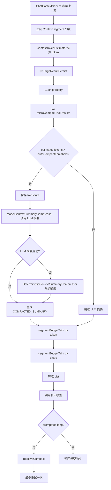

# 上下文压缩模块说明

日期：2026-06-25

本文说明当前 AI Studio / Code Review Agent 的上下文压缩模块，包括它解决什么问题、上下文如何组装、什么时候压缩、各层压缩策略、LLM 摘要压缩路径、配置项、测试方式和当前限制。

## 1. 模块目标

上下文压缩模块的目标不是“记忆模块”，也不是 RAG 知识库，而是解决每次调用大模型前的 prompt 预算问题。

它要保证：

1. 固定系统规则、当前用户输入、安全边界不能丢。
2. 历史对话、RAG、工具结果、workspace 文件、diff 等上下文能按价值分层保留。
3. 上下文接近模型窗口上限时，先做低成本压缩，再调用 LLM 做语义摘要。
4. API 返回 prompt too long 时，有 reactive compact 应急兜底路径。
5. 压缩过程有指标、测试和文档，后续能接真实 token usage、缓存命中和耗时统计。

当前核心代码包：

```text
chatbot-service/src/main/java/com/example/chatbot/context/
```

## 2. 和记忆模块的区别

上下文压缩模块和记忆模块不是一个概念。

| 模块 | 作用 | 生命周期 | 典型内容 |
| --- | --- | --- | --- |
| 上下文压缩 | 控制本轮 prompt 大小 | 每次模型调用前 | system、RAG、历史、工具结果、当前输入 |
| 记忆模块 | 保存长期用户偏好或事实 | 跨会话/长期 | 用户偏好、安全约束、项目背景 |
| 滚动摘要 | 历史对话的长期摘要 | 会话级 | 早期对话目标、结论、未完成事项 |
| RAG | 从知识库检索相关证据 | 每次请求动态检索 | 文档 chunk、代码片段、业务知识 |

上下文压缩可以消费“记忆”“滚动摘要”“RAG 结果”，但它本身主要负责：**本轮要塞进模型的东西如何裁剪和压缩**。

## 3. 当前上下文组装顺序

普通聊天上下文由 `ChatContextService` 构造。

当前顺序是：

```text
SYSTEM_FIXED
-> SESSION_SUMMARY
-> RECENT_HISTORY
-> RAG_CONTEXT
-> CURRENT_USER_INPUT
```

对应含义：

| 段类型 | 说明 |
| --- | --- |
| `SYSTEM_FIXED` | 主 system prompt，必须保留 |
| `SESSION_SUMMARY` | 早期对话滚动摘要 |
| `RECENT_HISTORY` | 最近 N 轮完整对话 |
| `RAG_CONTEXT` | 当前问题检索出的知识库上下文 |
| `CURRENT_USER_INPUT` | 当前用户输入，必须保留 |

当前工具 schema 还没有显式注入到 `ChatContextService` 的普通聊天路径里。Agent 工具调用路径后续可以把工具定义抽象成 `TOOL_SCHEMA` segment，放在 system 固定段附近，以便获得更好的前缀缓存效果。

最近窗口读取方式：

```text
构造 prompt 时只读取最近 recentWindowSize 条 ChatRecord。
Redis 操作等价于：LRANGE chat:history:{sessionId} -recentWindowSize -1
```

默认：

```text
recentWindowSize = 10
```

所以普通请求只读取最近 10 条 `ChatRecord`。`redisCacheSize=100` 仍用于 Redis List 缓存容量，不再代表每次 prompt 构造都读取 100 条。

滚动摘要刷新不再依赖 Redis 的 100 条候选窗口。已有摘要时，摘要刷新会从 MySQL 按 `lastSummarizedRecordId` 增量查询：

```sql
SELECT ...
FROM chat_record
WHERE session_id = ?
  AND id > ?
ORDER BY id ASC
LIMIT ?
```

这样长会话不会因为 Redis List 只保留最近 100 条而漏掉摘要增量。

## 4. 核心数据结构

上下文不再直接以 `List<Message>` 为唯一中间结构，而是先抽象成 `ContextSegment`。

核心字段：

```java
public class ContextSegment {
    private String id;
    private ContextSegmentType type;
    private String role;
    private String content;
    private int priority;
    private boolean required;
    private boolean compactable;
    private boolean toolResult;
    private String toolName;
    private String sourceRef;
    private int estimatedTokens;
    private LocalDateTime createdAt;
}
```

关键点：

1. `type` 决定上下文语义和默认裁剪优先级。
2. `required=true` 的段不能被普通裁剪删除。
3. `estimatedTokens` 由 tokenizer 估算，用于请求前预算。
4. `sourceRef/toolName/id` 用于压缩后保留可恢复引用。

## 5. Segment 类型和优先级

数字越小越重要，越不应该被裁剪。

| 类型 | 默认优先级 | 是否必保留 | 说明 |
| --- | ---: | --- | --- |
| `SYSTEM_FIXED` | 0 | 是 | 主系统规则 |
| `CURRENT_USER_INPUT` | 0 | 是 | 当前用户问题 |
| `TOOL_SCHEMA` | 1 | 通常是 | 工具定义，后续 Agent 路径可接入 |
| `USER_MEMORY` | 1 | 通常是 | 长期用户偏好和安全边界 |
| `SESSION_SUMMARY` | 2 | 否 | 滚动摘要 |
| `COMPACTED_SUMMARY` | 2 | 否 | 压缩后的摘要 |
| `RAG_CONTEXT` | 3 | 否 | 当前问题相关知识 |
| `RECENT_HISTORY` | 4 | 否 | 最近完整对话 |
| `WEB_CONTEXT` | 5 | 否 | Web 抓取上下文 |
| `WORKSPACE_FILE` | 6 | 否 | workspace 文件内容 |
| `CODE_REVIEW_DIFF` | 6 | 否 | Git diff / 代码审查 diff |
| `TOOL_RESULT` | 7 | 否 | 工具执行结果，最适合压缩 |

当前默认裁剪顺序大致是：

```text
TOOL_RESULT
-> WORKSPACE_FILE / CODE_REVIEW_DIFF
-> WEB_CONTEXT
-> RECENT_HISTORY
-> RAG_CONTEXT
-> SESSION_SUMMARY / COMPACTED_SUMMARY
```

`SYSTEM_FIXED` 和 `CURRENT_USER_INPUT` 不参与普通裁剪。

## 6. Tokenizer

当前本地 token 估算使用：

```text
com.knuddels:jtokkit:1.1.0
EncodingType.CL100K_BASE
```

实现文件：

```text
chatbot-service/src/main/java/com/example/chatbot/context/ContextTokenEstimator.java
```

作用：

1. 在请求前估算 prompt token。
2. 决定是否超过 `max-input-tokens`。
3. 决定是否触发 auto compact。

注意：

- `cl100k_base` 是近似 tokenizer，适合 OpenAI/DeepSeek 兼容模型的工程估算。
- 真实计费 token 仍以模型 API 返回的 `usage.prompt_tokens` 为准。
- tokenizer 初始化或运行失败时，会降级到启发式估算。

## 7. 压缩执行顺序

当前 `ContextCompressionService.compact()` 的执行顺序是：

```text
1. fillEstimatedTokens
2. L3 largeResultPersist
3. L1 snipHistory
4. L2 microCompactToolResults
5. 判断是否触发 L4 autoCompactSummary
6. L2.5 segmentBudgetTrim by token budget
7. L2.5 segmentBudgetTrim by char budget
8. 输出 ContextCompactionResult
```

设计原则：

```text
便宜的先跑，贵的后跑；
能结构化处理就不调 LLM；
结构化处理仍不足时，才调 LLM 摘要；
模型仍报 prompt too long 时，走 reactive compact。
```

## 8. L3：largeResultPersist

目标：避免大工具结果、大文件、大 diff 完整塞进 prompt。

触发对象：

```text
TOOL_RESULT
WORKSPACE_FILE
CODE_REVIEW_DIFF
WEB_CONTEXT
```

触发条件：

```yaml
large-result-max-chars: 200000
```

超过阈值后，原内容会替换为类似：

```text
[Persisted large context result]
type=TOOL_RESULT
tool=readWorkspaceFile
source=src/main/java/App.java
artifactId=...
originalChars=...
preview:
...
```

当前状态：

- 已实现 prompt 层占位和 preview。
- `sourceRef` 会追加 artifact 引用。
- 还没有真正把完整内容写入数据库或 workspace artifact。

后续建议：

```text
agent_context_artifact
agent_tool_execution_log.result_summary
```

真正持久化时必须带 `userId/sessionId/workspaceId` 权限隔离。

## 9. L1：snipHistory

目标：segment 数量太多时，裁掉中间旧上下文，保留头尾。

配置：

```yaml
snip-max-messages: 60
snip-head-messages: 6
snip-tail-messages: 40
```

行为：

```text
如果 segment 数量 > snip-max-messages：
  保留前 snip-head-messages 段
  保留后 snip-tail-messages 段
  中间可压缩段替换为 COMPACTED_SUMMARY 占位
```

注意：

- 不裁剪 `SYSTEM_FIXED`。
- 不裁剪 `CURRENT_USER_INPUT`。
- 未来如果接入真实 tool call message，需要避免把 tool_use 和 tool_result 拆开。

## 10. L2：microCompactToolResults

目标：旧工具结果不长期完整保留。

配置：

```yaml
keep-recent-tool-results: 3
```

行为：

```text
只保留最近 3 条 TOOL_RESULT 完整内容。
更旧 TOOL_RESULT 替换为：
  工具名
  sourceRef
  原始 estimatedTokens
  重新读取提示
```

示例：

```text
[Earlier tool result compacted]
tool=readWorkspaceFile
source=src/main/java/App.java
originalTokens=8000
Re-run or re-read the source when exact output is needed.
```

## 11. L2.5：segmentBudgetTrim

目标：经过 L1/L2/L3 后，如果仍超过预算，就按优先级删除低价值 segment。

预算配置：

```yaml
max-input-tokens: 24000
reserve-output-tokens: 4000
reserve-safety-buffer-tokens: 2000
```

当前实际裁剪使用：

```text
tokenBudget = app.chatbot.context.compression.max-input-tokens
charBudget = app.chatbot.context.max-context-chars
```

执行逻辑：

```text
while currentTokens > tokenBudget:
    removeBestCandidate()

while currentChars > charBudget:
    removeBestCandidate()
```

`RECENT_HISTORY` 有特殊处理：尽量按连续历史组裁剪，避免只删 user 或 assistant 造成半轮对话残留。

## 12. L4：autoCompactSummary

这是当前最重要的语义压缩层。

目标：当 0 API 结构化压缩仍不足，或者上下文接近预算阈值时，调用 LLM 生成语义摘要。

配置：

```yaml
auto-compact-enabled: true
auto-compact-threshold-ratio: 0.80
max-consecutive-auto-compact-failures: 3
```

触发条件：

```text
estimatedTokens > maxInputTokens * autoCompactThresholdRatio
```

当前默认：

```text
maxInputTokens = 24000
thresholdRatio = 0.80
触发阈值约 = 19200 estimated tokens
```

处理流程：

```text
1. 保存压缩前 transcript 快照
2. 选出旧的、非 required、可压缩 segments
3. 调用 ContextSummaryCompressor
4. 用 COMPACTED_SUMMARY 替换旧上下文
5. 重新计算 token
6. 如果仍超预算，再进入 segmentBudgetTrim
```

## 13. LLM 摘要器

当前语义摘要器是：

```text
ModelContextSummaryCompressor
```

文件：

```text
chatbot-service/src/main/java/com/example/chatbot/context/ModelContextSummaryCompressor.java
```

它是 `@Primary` Bean，生产环境默认优先使用它。

模型选择顺序：

```text
1. OpenAiChatModel
   也就是当前 DeepSeek / OpenAI 兼容配置
2. OllamaChatModel
3. DeterministicContextSummaryCompressor 降级
```

也就是说：

```text
上下文超出后的主压缩策略 = LLM 语义摘要
Java 本地规则摘要 = 模型不可用时的降级方案
```

LLM 摘要 prompt 关键要求：

```text
Respond with text only. Do not call tools.
Do not invent facts.
Preserve IDs, file paths, user constraints, safety boundaries, pending actions, unresolved work, and important decisions.
Keep exact identifiers and paths unchanged.
```

输出结构要求：

```text
1. 当前目标
2. 已确认约束
3. 关键上下文
4. 文件/工具/ID引用
5. 未完成事项
```

## 14. 本地降级摘要器

本地降级摘要器是：

```text
DeterministicContextSummaryCompressor
```

它不调用模型，只保留结构化元信息：

```text
type
id
sourceRef
toolName
estimatedTokens
```

它的定位：

```text
不是主压缩策略；
不是语义摘要；
只在模型不可用、调用失败或返回空内容时兜底。
```

## 15. Reactive Compact

目标：如果模型 API 仍返回 prompt too long，做应急压缩后最多重试一次。

配置：

```yaml
reactive-compact-enabled: true
max-reactive-compact-retries: 1
```

当前状态：

- `ContextCompressionService.reactiveCompact()` 已实现。
- 会保存 transcript。
- 会更激进地压缩早期上下文。
- 会保留尾部上下文和当前输入。

尚未完成：

- 还没有接入具体模型调用异常捕获链路。
- 下一步应在 DeepSeek/OpenAI/Ollama 报 `prompt_too_long`、`context length exceeded` 等错误时调用它，并最多重试一次。

## 16. Transcript 保存

压缩前快照由：

```text
ContextTranscriptService
```

负责。

当前实现：

```text
内存 ConcurrentHashMap
```

保存字段：

```text
transcriptId
reason
createdAt
segments
```

当前用途：

- auto compact 前保存原始上下文。
- reactive compact 前保存原始上下文。
- 为后续审计和恢复预留结构。

当前限制：

- 进程重启会丢。
- 没有 userId/sessionId/workspaceId 隔离字段。

后续正式化建议：

```text
新增 agent_context_transcript / agent_context_artifact 表
保存 userId、sessionId、workspaceId、reason、sha256、createdAt、expiresAt
恢复 artifact 时必须做权限校验
```

## 17. 配置项

当前配置位置：

```text
chatbot-service/src/main/resources/application.yml
```

配置前缀：

```yaml
app:
  chatbot:
    context:
      compression:
```

当前配置：

```yaml
enabled: true
max-input-tokens: 24000
reserve-output-tokens: 4000
reserve-safety-buffer-tokens: 2000
snip-max-messages: 60
snip-head-messages: 6
snip-tail-messages: 40
keep-recent-tool-results: 3
large-result-max-chars: 200000
large-result-preview-chars: 2000
auto-compact-enabled: true
auto-compact-threshold-ratio: 0.80
max-consecutive-auto-compact-failures: 3
reactive-compact-enabled: true
max-reactive-compact-retries: 1
```

环境变量覆盖示例：

```text
APP_CHATBOT_CONTEXT_COMPRESSION_MAX_INPUT_TOKENS
APP_CHATBOT_CONTEXT_COMPRESSION_AUTO_COMPACT_ENABLED
APP_CHATBOT_CONTEXT_COMPRESSION_REACTIVE_COMPACT_ENABLED
```

## 18. 当前测试

核心测试文件：

```text
chatbot-service/src/test/java/com/example/chatbot/context/ContextCompressionServiceTest.java
chatbot-service/src/test/java/com/example/chatbot/context/ModelContextSummaryCompressorTest.java
chatbot-service/src/test/java/com/example/chatbot/service/ChatContextServiceTest.java
chatbot-service/src/test/java/com/example/chatbot/service/ChatContextServiceBenchmarkTest.java
```

覆盖内容：

1. 字符预算裁剪。
2. token 预算优先裁剪。
3. 低价值 segment 先裁剪。
4. 最近历史按对话组裁剪。
5. 大结果 preview 占位。
6. 旧工具结果微压缩。
7. 中段历史 snip。
8. auto compact 摘要替换。
9. reactive compact 保留尾部和当前输入。
10. LLM 摘要器使用配置模型。
11. LLM 摘要失败后降级到本地摘要。

验证命令：

```bash
mvn -q -pl chatbot-service "-Dtest=ChatContextServiceTest,ChatContextServiceBenchmarkTest,ContextCompressionServiceTest,ModelContextSummaryCompressorTest" test
```

最近一次验证结果：通过。

最新 benchmark：

```text
[ContextBenchmark] runs=50 messages=23 chars=2090 estimatedTokens=1199 stablePrefixChars=45 stablePrefixRatio=2.15% avgBuildMs=1.196
```

## 19. 当前完整流程图



## 20. 当前限制和下一步

当前限制：

1. `largeResultPersist` 还没有真正持久化大内容，只是 prompt 层引用和 preview。
2. `ContextTranscriptService` 还是内存存储，不适合生产审计。
3. LLM 摘要复用主聊天模型，还没有独立 summary model 配置。
4. `reactiveCompact()` 已实现，但还没有接入实际模型异常捕获和重试链路。
5. `max-consecutive-auto-compact-failures` 配置已有，但熔断计数逻辑还没有完整落地。
6. `reserve-output-tokens` 和 `reserve-safety-buffer-tokens` 已配置，但当前预算主要仍使用 `max-input-tokens`。
7. 工具 schema 还没有作为 `TOOL_SCHEMA` 固定前缀正式接入。

建议下一阶段：

1. 接入 prompt-too-long 异常识别和 reactive retry。
2. 将 transcript/artifact 写入数据库或 workspace artifact，并加 userId/sessionId/workspaceId 隔离。
3. 增加 summary 专用模型配置、最大输出 token、超时和失败熔断。
4. 把真实 provider usage 记录到请求日志：`prompt_tokens`、`cache_hit_tokens`、`cache_miss_tokens`。
5. 给 Agent 工具定义和固定 system prompt 做固定前缀布局，为前缀缓存优化做准备。
